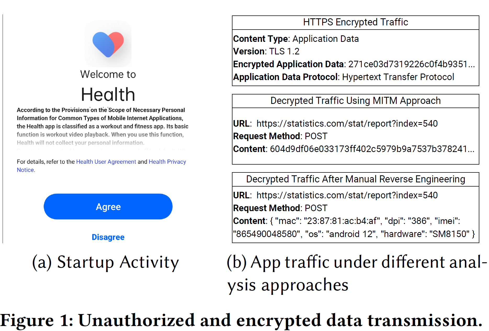

# WhisperCatcher: Demystifying Unauthorized and Encrypted Private Data Transmission in Android Applications

## Overview

WhisperCatcher is an automated tool designed for detecting unauthorized and encrypted private data transmission behaviors in Android applications.  By integrating traffic-semantics-guided static code analysis, dynamic instrumentation, and llm-based private data extraction, WhisperCatcher can effectively identify private data transmissions before the user consents to the privacy policy, and significantly outperforms existing approaches.

<div align="center">

</div>

## Motivating Example

Mobile apps may collect and transmit users' private data before users consent to the privacy policy (unauthorized data transmission, *UDT*), which violates users' privacy rights and breaches existing regulations such as GDPR and PIPL. To obfuscate the transmission of private data, some apps encrypt such data within the app code, making it challenging for existing tools to detect. To address this issue, we design WhisperCatcher, which can effectively detect private data transmitted in plaintext traffic, HTTPS-encrypted traffic and app-encrypted traffic.

<div align="center">

</div>

## Methodology

WhisperCatcher employs the following four-stage pipeline.

- Raw Traffic Capturing
  - capture the raw traffic generated during the app's startup phase, before the user consents to the privacy policy
  - plaintext traffic/https-encrypted traffic will be directly used for identifying unauthorized private data transmissions
  - app-encrypted traffic will be further analyzed
- Traffic Semantics Analysis
  - extract semantic keywords from the captured traffic
- Transmission Functions Identification
  - perform traffic-semantics-guided static code analysis
  - extract key functions that may handle private data in plaintext form
- Private Data Extraction and Analysis
  - instrumentation
  - employ LLM to identify transmitted private data in complex scenarios

## Evaluation

### Capabilities for Data Transmission Detection

<div align="center">

</div>

### Effectiveness

<div align="center">

</div>

## Installation & Setup

### Prerequisites

- Python 3.11+ (recommended python version: 3.11)
- Rooted Android device
- Android SDK Tools
- Java JDK (>=8)
- mitmproxy environment configured
- Construct the system traffic blacklist (`src/system_traffic_blacklist.txt`)

> **References:**
> [1] [Mtimproxy Installation](https://docs.mitmproxy.org/stable/overview-installation/)
> [2] [Getting Started with Mitmproxy](https://docs.mitmproxy.org/stable/overview-getting-started/)

### Quick Start

#### Install dependencies

Using `pip`:

```bash
pip install -r requirements.txt
```

or using `uv`:

```bash
uv sync
```

#### Environment setup

1. **mitmproxy**: Make sure the traffic capturing works between your Android device and host PC
2. **Frida**: Push `frida-server` to your Android device (default: `/data/local/tmp/`, rename it to `fs16.1.5arm64`) or use the provided file `tmp/fs16.1.5arm64`
3. **Android SDK**: Add `${ANDROID_HOME}/platform-tools` to `PATH`
4. **Java**: Add JDK (>=8) to `PATH`
5. **Config**: Edit `src/config.py` for your configuration

#### Launch

```bash
python src/whispercatcher.py # refer to this file for input & output information
```

#### Example Pipelines

After completing the environment setup, you can use the samples in `apks` to test the entire workflow.

1. Launch `src/whispercatcher.py` (The following workflow will be completed automatically.)
2. Raw traffic capturing: traffic files will be recorded in `${output}/traffic`
3. Traffic filtering: system traffic will be filtered using `src/system_traffic_blacklist.txt`, filtered traffic will be recorded in `${output}/traffic_filtered`
4. Traffic semantics analysis & Transmission functions identification: using traffic semantics to identify transmission-related key functions, call graph will be recorded in `${output}/soot_analyze` and transmission-realted key functions will be recorded in `${output}/key_apis`
5. Instrumentation: key functions will be instrumented and their runtime information will be recorded in `${output}/hook`
6. LLM-based private data identification: LLM will be employed to identify private data using network traffic and function runtime information. Any transmitted private data indicates the UDT behavior.

For more details, please refer to the code and our paper.

## Citation

If you find this project helpful, please consider citing our paper. :)

```text
@inproceedings{qiu2026whispercatcher,
  title={WhisperCatcher: Demystifying Unauthorized and Encrypted Private Data Transmission in Android Applications},
  author={Qiu, Zhaoyu and Fan, Ming and Ma, Bocan and Tang, Yutian and Xue, Lei and Wang, Haijun and Liu, Ting},
  booktitle={2026 IEEE/ACM 48th International Conference on Software Engineering (ICSE)},
  pages={},
  year={2026}
}
```

## License

This project is licensed under the GNU Affero General Public License v3.0 (AGPL-3.0).  
See the [LICENSE](./LICENSE) file for details.
